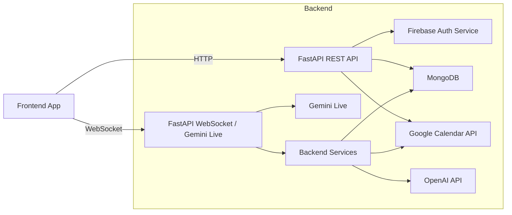
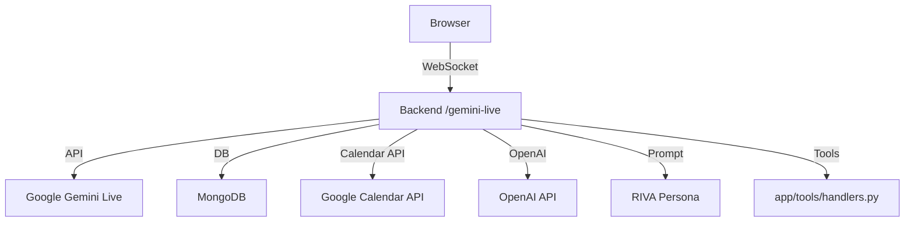

# RIVA-ML Backend Architecture

## Overview

This file describes the backend architecture for the `riva-ml` service.
It covers:

- High-level components
- Request flows
- Data stores and services
- Authentication and AI integrations
- Diagrams showing the backend structure

---

## 1. High-Level Architecture

The backend is a FastAPI application located in `app/main.py`.
It exposes:

- HTTP REST endpoints for auth, user profile, finance, calendar, and to-dos
- A WebSocket endpoint for live Gemini voice interaction and tool execution

The backend interacts with:

- MongoDB (async via `motor`)
- Firebase for auth
- Google Calendar API via OAuth
- Gemini Live for voice-based AI conversations
- OpenAI for finance query understanding

### High-level component map

---

## 2. Main Components

### `app/main.py`

- Creates the `FastAPI` application
- Loads environment variables with `dotenv`
- Configures CORS middleware
- Includes router modules:
  - `auth_router`
  - `user_router`
  - `finance_router`
  - `calendar_router`
  - `todo_router`
  - `gemini_live_router`
- Defines health check endpoints `/` and `/home`

### Routers

#### `app/routers/auth.py`

- `POST /auth/login`
- `GET /auth/login-web`
- `GET /auth/callback`
- `GET /user/profile`

Functions:
- verify Firebase ID tokens
- create or update user records in MongoDB
- support Google OAuth login redirects
- return authenticated user profile

#### `app/routers/finance_routes.py`

- `GET /finance/transactions`
- `POST /finance/transactions`
- `PATCH /finance/transactions/{id}`
- `DELETE /finance/transactions/{id}`
- `GET /finance/summary`
- `GET /finance/budgets`
- `POST /finance/budgets`
- `POST /finance/budgets/total`
- `DELETE /finance/budgets/{category}`
- `GET /finance/budgets/status`
- `POST /finance/budgets/refine`
- `GET /finance/categories`

#### `app/routers/calendar_routes.py`

- `GET /calendar/status`
- `GET /calendar/oauth/url`
- `GET /calendar/oauth/callback`
- `POST /calendar/disconnect`
- `GET /calendar/events`
- `POST /calendar/events`
- `PUT /calendar/events/{event_id}`
- `DELETE /calendar/events/{event_id}`

#### `app/routers/todo_routes.py`

- `GET /todos`
- `GET /todos/stats`
- `POST /todos`
- `PUT /todos/{todo_id}`
- `POST /todos/{todo_id}/complete`
- `POST /todos/{todo_id}/uncomplete`
- `DELETE /todos/{todo_id}`

#### `app/routers/gemini_live.py`

- `WebSocket /gemini-live`
- real-time voice and text integration with Gemini Live
- tool invocation logic for finance, calendar, and tasks
- session management, reconnect handling, and audio forwarding

---

## 3. Service Layer

### `app/services/db.py`

- Configures MongoDB connection using `AsyncIOMotorClient`
- Defines collections used across the backend:
  - `users`
  - `transactions`
  - `budgets`
  - `financial_goals`
  - `user_memory`
  - `conversation_summary`
  - `action_log`
  - `calendar_tokens`
  - `todos`

### `app/services/auth_service.py`

- Initializes Firebase Admin SDK
- Verifies Firebase tokens with `auth.verify_id_token()`
- Creates or updates user profile documents in MongoDB
- Fetches users by UID

### `app/services/calendar_service.py`

- Handles Google OAuth redirect and token exchange
- Stores OAuth tokens in MongoDB
- Refreshes access tokens when expired
- Uses Google Calendar REST API to list, create, update, and delete events

### `app/services/todo_service.py`

- CRUD operations for tasks stored in MongoDB
- Filtering by due date, priority, category, and status
- Helpers for schedule and overdue summaries

### `app/services/budget_service.py`

- Manages budget profile documents per user
- Computes spending status compared to budgets
- Suggests and applies AI-driven budget refinements

### `app/services/finance_query_service.py`

- Uses OpenAI to interpret natural language finance requests
- Builds MongoDB query specs from user text
- Summarizes query results into human-friendly responses

### `app/services/memory_service.py`

- Stores user memories, preferences, habits, constraints, goals
- Supports CRUD operations and specialized retrieval

### `app/services/schedule_context.py`

- Builds a combined schedule snapshot from calendar events and todos
- Provides a text summary for AI prompts

### `app/services/riva_brain.py`

- Defines RIVA persona and skill prompts
- Builds the system prompt used by Gemini and AI agents
- Includes productivity, wellness, and finance behavior rules

---

## 4. Gemini Live Voice Architecture

### `app/tools/schemas.py`

- Declares tool functions Gemini can call
- Includes parameters and descriptions for:
  - finance tools
  - calendar tools
  - todo tools
  - conversation control

### `app/tools/handlers.py`

- Executes tool calls received from Gemini Live
- Implements behavior for:
  - `add_transaction`
  - `query_spending`
  - `schedule_event`
  - `list_events`
  - `add_todo`
  - `list_todos`
  - `complete_todo`
  - `get_budget_status`
  - `set_budget`
- Uses background tasks for write operations to keep Gemini responsive
- Returns structured responses usable by Gemini

### Gemini flow

1. Browser connects to `/gemini-live` via WebSocket
2. Backend accepts connection and optionally authenticates via token
3. Backend creates Gemini Live session using `google.genai`
4. Backend builds a rich system prompt from `riva_brain.py` and schedule context
5. Frontend audio/text is forwarded into Gemini
6. Gemini may request tools; backend executes them and sends results back
7. Gemini returns audio and/or text responses to the browser

---

## 5. Request Flow Examples

### Example: REST To-do creation

1. Frontend sends `POST /todos?user_id=<uid>` with task details.
2. `todo_routes.py` receives the request.
3. It calls `TodoService.add_todo()`.
4. Todo document is inserted into the `todos` collection.
5. Response returns the created todo.

### Example: Calendar event creation

1. Frontend sends `POST /calendar/events?user_id=<uid>`.
2. `calendar_routes.py` checks calendar connection.
3. `CalendarService.create_event()` calls Google Calendar API.
4. The event is created in the user's Google Calendar.
5. Response returns event metadata.

### Example: Voice expense logging via Gemini

1. User speaks in frontend to Gemini Live.
2. Backend forwards audio to Gemini.
3. Gemini parses intention and calls `add_transaction` tool.
4. `handlers.py` inserts a transaction into MongoDB.
5. Gemini receives tool result and responds verbally to the user.

---

## 6. Data & Authentication Summary

### Data stores

- `users`: authenticated user records
- `transactions`: expense/income history
- `budgets`: budget profile per user
- `calendar_tokens`: OAuth tokens for Google Calendar
- `todos`: user tasks
- `user_memory`: user preferences and constraints
- `conversation_summary`, `action_log`: AI history and audit logs

### Auth stack

- Firebase ID token verification for REST auth
- Google OAuth for calendar access
- WebSocket uses JWT-style auth token if provided

### Environment variables

Important settings include:

- `MONGO_URI`
- `OPENAI_API_KEY`
- `GEMINI_API_KEY`
- `FIREBASE_CONFIG` or local `firebase_key.json`
- `GOOGLE_CALENDAR_CLIENT_ID`
- `GOOGLE_CALENDAR_CLIENT_SECRET`
- `OAUTH_REDIRECT_URI`
- `FRONTEND_URL`
- `BASE_URL`

---

## 7. Notes and Improvements

- The backend is async-first, optimized for FastAPI + WebSocket real-time use.
- Gemini Live sessions are stateful and can handle audio + tool calls.
- Some REST routes still rely on `user_id` query params instead of full token auth.
- The architecture supports future extension with more AI tools and local LLM providers.

---

## 8. Useful file locations

- `app/main.py`
- `app/routers/auth.py`
- `app/routers/finance_routes.py`
- `app/routers/calendar_routes.py`
- `app/routers/todo_routes.py`
- `app/routers/gemini_live.py`
- `app/services/db.py`
- `app/services/auth_service.py`
- `app/services/calendar_service.py`
- `app/services/todo_service.py`
- `app/services/budget_service.py`
- `app/services/finance_query_service.py`
- `app/services/memory_service.py`
- `app/services/schedule_context.py`
- `app/services/riva_brain.py`
- `app/tools/handlers.py`
- `app/tools/schemas.py`
